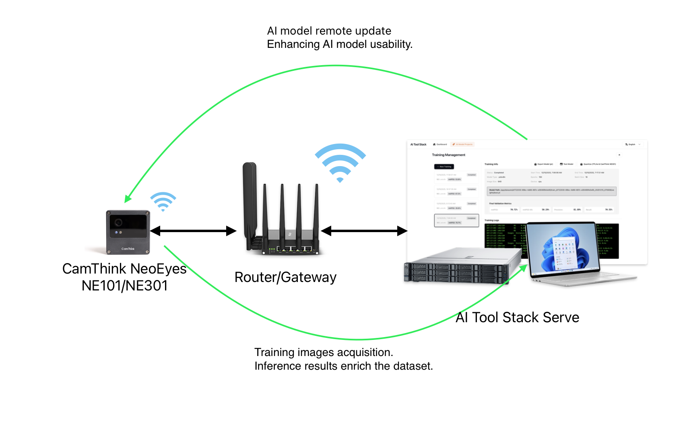
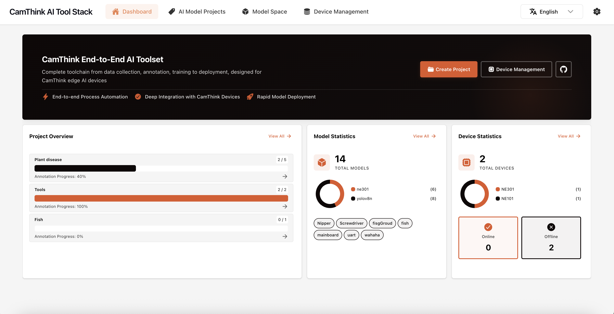
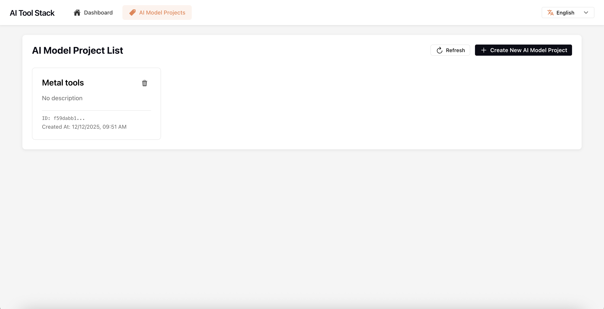

# Overview

[English](README.md) | [中文](README.zh.md)



AI Tool Stack is an end-to-end edge AI toolkit dedicated to [NeoEyes NE301](https://github.com/camthink-ai/ne301), covering data collection, annotation, training, quantization, and deployment.

Why do we need AI Tool Stack when there are many annotation tools in the community? CamThink focuses on the usability and sustainability of model edge deployment. Therefore, unlike traditional Vision AI workflows that think about scenarios first, annotate data, train models, and then consider edge deployment, we first clarify the hardware foundation for edge deployment, and then collect physical world images based on the hardware and quickly deploy models to rapidly solve AI implementation problems in fragmented scenarios. This tool, combined with the device, can complete the full cycle of device raw image data collection, annotation, training, quantization, edge deployment, and then image collection, dataset enrichment, retraining, and redeployment to achieve the feasibility of visual models for single scenarios. We focus on the actual value and investment cost of AI implementation and hope to accelerate this process.

The model training and quantization capabilities of this tool depend on the open-source library [ultralytics](https://github.com/ultralytics/ultralytics). Special thanks!

**If you need to understand how this tool works with NE301 for a complete workflow, please read the documentation in detail: [NE301 and AI Tool Stack Guide](https://wiki.camthink.ai/docs/neoeyes-ne301-series/application-guide/ai-tool-stack/)**





## Core Features

### AI Model Project Management
- **Data Collection & Management**: Supports automatic image data collection from cameras via MQTT and upload to project space for unified data management. Supports multi-device access with real-time viewing and filtering of collection progress.
- **Annotation Workbench**: Provides shortcut-driven efficient annotation workflows, supporting multiple annotation types such as object detection and classification. Built-in class management for flexible label addition and deletion, supports dataset import and export in COCO / YOLO / project annotation ZIP formats.
- **Training & Testing**: Built-in YOLO architecture-based model training and testing tools. Supports setting training parameters, custom dataset allocation, real-time viewing of training logs and result reports. Training and quantization features depend on the [ultralytics/ultralytics](https://github.com/ultralytics/ultralytics) project. Currently supports yolov8n, with more models and algorithm support to be added in the future.
- **Quantization & Deployment**: Integrated NE301 quantization and model packaging tools, enabling one-click export of model file packages suitable for NE301 devices, deployable to edge AI devices without coding. Supports automatic compatibility checking and inference speed evaluation.

### Model Space Management (New Feature)
- **Model Management**: Each trained and quantized model is automatically saved as an independent version and can be rolled back or exported at any time for traceability and comparison.
- **Model Testing**: Supports result testing of different model versions to help select the best model for deployment to devices.
- **External Model Quantization Support**: Supports importing existing YOLO models and quantizing them into NE301 model resources without retraining, accelerating your edge deployment.

## Requirements
- Docker & docker-compose (required). Please refer to [Docker official installation guide](https://docs.docker.com/get-docker/) and [docker-compose installation documentation](https://docs.docker.com/compose/install/) for installation.
- If you need to generate the NE301 quantization model package, please pull the image in advance: 
  ```
  docker pull camthink/ne301-dev:latest
  ```

> **Related Project**: [NE301 - STM32N6 AI Vision Camera](https://github.com/camthink-ai/ne301) - Device firmware and development repository.


## Quick Start (Docker)

Clone the repository:
```bash
git clone https://github.com/camthink-ai/AIToolStack.git
cd AIToolStack
```
Deploy with Docker:
```bash
docker-compose build
docker-compose up
```
> **Note: Configuration parameters are now defined in the configuration file.**  
> To modify parameters such as `MQTT_BROKER_HOST`, please edit the environment variables in `docker-compose.yml`.  
> Ensure the address is accessible by NE301 devices (usually use the host machine's actual IP address, not `localhost`).

### Local Development (optional)
Run frontend and backend separately:
```bash
cd frontend && npm install && npm start
cd backend  && pip install -r requirements.txt && uvicorn main:app --reload
```
API routes live in `backend/api/routes.py`  
Frontend config is in `frontend/src/config.ts`.

## Roadmap
- ✅ **Model Hub**: Import and quantization support for existing models, with simple model management
- 🛠️ **Device Management**: NE301 data debugging, AI model remote updates, collected data upload to project library with detection result annotation to enrich datasets

## Ports & Environment Variables
- **Default ports (docker-compose)**:  
  - Backend / API: `8000`  
  - Frontend (react-scripts in container): `3000` (proxied/mapped, check logs)  
- **Key environment variables (examples)**:  
  - `API_BASE_URL`: Frontend API base address (e.g., `http://localhost:8000`)  
  - `MQTT_BROKER_HOST`: MQTT broker host/IP (e.g., `localhost` or broker service name in compose)  
  - `MQTT_BROKER`, `MQTT_TOPIC`: NE301 MQTT settings
  - `DATASETS_ROOT`: Backend dataset storage path  
  - More variables can be configured in `.env` or compose environment variable overrides.

## Troubleshooting
- **Build fails (frontend) missing assets**: Ensure all referenced CSS/TSX files exist (`DatasetImportModal.css` etc.).  
- **Port conflicts**: Adjust mapped ports in `docker-compose.yml`.  
- **Slow annotation layer on fast navigation**: Caching has been added; still slow → reduce image size (JPEG/WebP) or check network/CPU.

## Contributing
- Issues & PRs welcome.  

## License
- Please add your license of choice (e.g., MIT/Apache-2.0). Add `LICENSE` file and reference it here.

