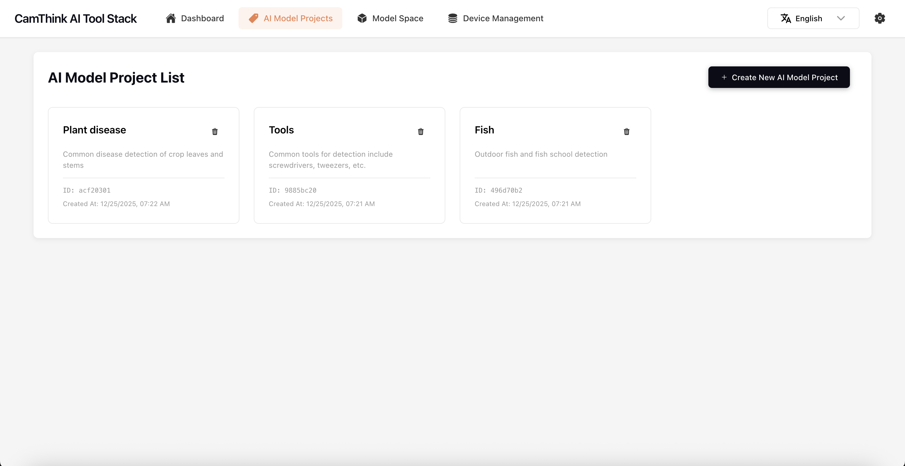

# 项目概述

[English](README.md) | [中文](README.zh.md)


**AI Tool Stack** 是专为 [NeoEyes NE301/NE101](https://github.com/camthink-ai/ne301) 及其它行业边缘设备打造的端到端 AI 工具套件，覆盖数据采集、标注、训练、量化、部署全流程，可显著提升视觉模型实际落地的效率与可靠性。

为什么要选择 AI Tool Stack？当前主流 Vision AI 工具链较多关注大规模云端训练和汲取互联网数据，而**CamThink 致力于**让**边缘硬件上的 AI 落地变得自动化、按需组织、小步快跑且高性价比**。我们创新性地以“**硬件驱动的数据闭环 + 一体化生产部署**”为理念，将**设备图像自动采集->标签标注->模型训练量化—>键部署到边缘设备**深度整合，支持模型持续优化与快速迭代，极大解决碎片化场景下的小规模专用视觉模型高成本痛点。

此工具的模型训练与量化能力依赖于开源库 [ultralytics](https://github.com/ultralytics/ultralytics)，特此表示感谢！

**如果你需要了解此工具如何配合NE301进行完整的工作流程请详细阅读文档「[NE301 and AI Tool Stack Guide ](https://wiki.camthink.ai/docs/neoeyes-ne301-series/application-guide/ai-tool-stack/)**」

<div align="center">

| 仪表盘 | 项目管理 | 标注工作台 |
|:---:|:---:|:---:|
|  |  |  |

| 模型训练 | 模型空间 | 模型测试 |
|:---:|:---:|:---:|
|  |  |  |

| 设备管理 | 系统设置 |
|:---:|:---:|
|  |  |

</div>

## 核心功能

### AI模型项目
- **数据采集与管理**：支持相机通过 MQTT 自动采集图像数据，并上传至项目空间，实现数据的统一管理。支持多设备接入，实时查看和筛选采集进度。
- **标注工作台**：提供快捷键驱动的高效标注流程，支持目标检测、分类等多种标注类型。内置类别管理，可灵活增删标签，支持数据集的 COCO / YOLO / 本项目标注 ZIP 格式导入与导出。
- **训练与测试**：内置基于 YOLO 架构的模型训练和测试工具。支持设置训练参数、自定义数据集分配、实时查看训练日志及结果报告。训练与量化功能依赖 [ultralytics/ultralytics](https://github.com/ultralytics/ultralytics) 项目，目前支持 yolov8n，未来将持续新增更多模型与算法支持。
- **量化与部署**：集成 NE301 量化与模型打包工具，可一键导出 NE301 设备适用的模型文件包，无需编码即可部署到边缘 AI 设备。支持自动检查兼容性和推理速度评估。
- **绑定数据源（新）**：支持CamThink NeoEyes NE101/NE301绑定项目，设备图像数据可以无缝传输到项目中进行标注

### 模型空间
- **模型管理**：每次训练和量化的模型都自动保存为独立版本，并可随时回滚或导出，便于追溯和比较。
- **模型测试**：支持不同模型版本的结果测试，助力挑选最佳模型部署至设备。
- **外部模型量化支持**：支持导入已有的 yolo 模型并量化为 NE301 模型资源，无需重新训练，加速你的边缘部署。

### 设备管理（新功能）
- **支持 NE101/NE301 设备接入**：设备可接入 AIToolStack，实时检测设备在线/离线状态，并进行基础信息与状态管理。
- **设备绑定项目**：可将设备与AI 模型项目进行绑定，设备采集的图像自动归类推送至对应项目空间，便于批量训练和数据集整理。
- **设备信息与溯源**：管理设备名称，并可查询设备历史采集和上报数据，实现数据的溯源与便捷检索。

### 系统设置（新功能）
- **多MQTT Broker管理**：系统支持同时订阅和管理多个外部 MQTT Broker，满足多场景数据协同需求。
- **MQTTS 加密协议支持**：内置 MQTT Broker 已支持 MQTTS 协议，用户可在界面配置 Broker 参数（如证书、端口、权限等）。
- **MQTT 证书管理**：新增证书管理模块，支持导入、生成、多套 MQTT 证书一键切换，保障设备与服务端的安全接入。

---

## 环境要求
- **Docker & docker-compose（必需）**  
  请参考 [Docker 官方安装指南](https://docs.docker.com/get-docker/) 和 [docker-compose 指南](https://docs.docker.com/compose/install/) 进行部署。
- **NE301 量化模型包生成**  
  需预拉取量化环境镜像：
  ```
  docker pull camthink/ne301-dev:latest
  ```
- **推荐支持的设备**  
  - 本地主机或服务器部署AIToolStack
  - 使用CamThink NeoEyes NE101/NE301作为数据采集设备

---

## 快速上手（Docker）

1. 克隆代码仓库
   ```bash
   git clone https://github.com/camthink-ai/AIToolStack.git
   cd AIToolStack
   ```

2. Docker 部署项目
   ```bash
   docker-compose build
   docker-compose up
   ```

   > **提示：主要参数已在配置文件定义。若需自定义 `MQTT_BROKER_HOST` 等，请编辑 `docker-compose.yml` 的环境变量项，并确保设备可访问「宿主机实际IP」。**

### 本地开发体验（可选）

如需分离开发调试（推荐熟悉前后端开发的用户），可分别运行前端与后端：

```bash
cd frontend  && npm install && npm start
cd backend   && pip install -r requirements.txt && uvicorn main:app --reload
```

- 后端 API 路由见 `backend/api/routes.py`
- 前端服务基础配置见 `frontend/src/config.ts`

---

## 路线图

- 🚀 **自动标注**：已启动自动标注后端/前端开发，实现模型带标签推理+手动审核闭环
- 🤖 **AI推理支持**：前端采集实时推送至后端，API推理结果自动写回标注数据库（已验证主链）
- 📡 **设备集成**：支持 NE301 OTA 远程推流、远程模型包同步与切换（v1.2 规划中）
- 🔄 **模型兼容性**：已兼容 YOLOv8，持续拓展 yolov10/12/Segment/and more
- 🧑‍💻 **多用户/权限**（计划中）：将在未来支持多角色账号与资源权限隔离管理

---

## 端口与环境变量说明

- **默认端口（docker-compose）**：
  - API（后端）：`8000`
  - 前端 React：`3000`（容器内、通过代理直连后端）
- **主要环境变量（可自定义）**：
  - `API_BASE_URL`：前端 API 地址 (一般为 `http://localhost:8000`)
  - `MQTT_BROKER_HOST`：MQTT Broker 服务主机名或 IP（如设备间网络需指定宿主机真实 IP）
  - `MQTT_BROKER`, `MQTT_TOPIC`：NE301 端 MQTT 配置
  - `DATASETS_ROOT`：后端数据集目录（建议挂载映射持久化）
  - 其他详细变量可通过 `.env` 文件或 docker-compose 环境中覆盖

---

## 贡献与支持

欢迎大家通过 Issues、PR 参与项目共建及功能提案！

## 贡献

欢迎提交 Issues 和 PR。

## 许可证

本项目采用 [MIT License](./LICENSE) ，可自由使用和二次开发，引用请注明原出处。
